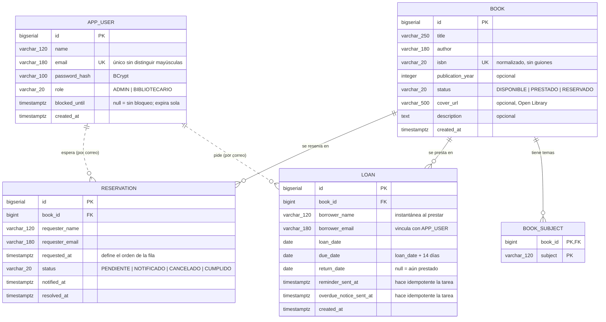

**🌐 Idioma:** [English](data-model.md) · **Español**

# Modelo de datos

Esquema real generado por las migraciones de Flyway
([`V1__create_schema.sql`](../backend/src/main/resources/db/migration/V1__create_schema.sql)),
que es la única fuente de verdad: Hibernate arranca con `ddl-auto: validate` y falla si el
código y la base dejan de coincidir.

## Diagrama entidad-relación



Las líneas punteadas hacia `APP_USER` son intencionales: **no hay clave foránea**.

## Por qué el préstamo no tiene FK al usuario

El enunciado define `Loan` con `borrowerName` y `borrowerEmail`, sin relación a `AppUser`,
pero al mismo tiempo pide `GET /api/loans/mine` y bloquear cuentas por atrasos. Se respetó
el enunciado y se resolvió el vínculo **por correo**:

- `borrower_name` es una **instantánea** del momento del préstamo. Si mañana la persona
  cambia su nombre, el registro histórico sigue diciendo a quién se le entregó el libro.
- El bloqueo y `/mine` se resuelven buscando `app_user` por `lower(email)`.

Está documentado en el README como decisión propia.

## Reglas de negocio que vive la base de datos

No todo se confía al servicio: hay invariantes que están en el esquema, de modo que ni una
condición de carrera ni una consulta manual pueden romperlas.

| Índice / restricción | Qué garantiza |
|---|---|
| `uk_loan_open_per_book` (único parcial `WHERE return_date IS NULL`) | **Un ejemplar no puede estar prestado dos veces a la vez** |
| `uk_reservation_active` (único parcial `WHERE status IN ('PENDIENTE','NOTIFICADO')`) | Nadie ocupa dos lugares en la misma fila |
| `uk_app_user_email` (único sobre `lower(email)`) | `Ana@x.cl` y `ana@x.cl` son la misma cuenta |
| `ck_book_status`, `ck_reservation_status`, `ck_app_user_role` | Los enum no admiten valores inventados |
| `ck_loan_due_after_loan`, `ck_loan_return_after_loan` | Fechas coherentes entre sí |
| `ix_loan_open_due_date` (parcial) | Las tareas diarias no recorren el historial completo |

## Cómo mirar la base

Con el stack levantado (`docker compose up`):

```bash
# Consola SQL interactiva
docker exec -it libris-postgres psql -U libris -d libris

# Una consulta suelta
docker exec libris-postgres psql -U libris -d libris -c "select * from book limit 5;"
```

Desde un cliente gráfico (DBeaver, pgAdmin, DataGrip):

| Campo | Valor |
|---|---|
| Host | `localhost` |
| Puerto | `5432` |
| Base de datos | `libris` |
| Usuario | `libris` |
| Contraseña | `libris` |

## Consultas útiles

```sql
-- Estado del catálogo
select status, count(*) from book group by status;

-- Préstamos abiertos con su situación
select b.title, l.borrower_email, l.due_date,
       case when l.due_date < current_date then 'VENCIDO'
            when l.due_date <= current_date + 3 then 'POR VENCER'
            else 'ACTIVO' end as estado
from loan l join book b on b.id = l.book_id
where l.return_date is null
order by l.due_date;

-- La regla de los 3 atrasos en 90 días, tal como la calcula el backend
select borrower_email, count(*) as atrasos
from loan
where return_date is not null
  and return_date > due_date
  and return_date >= current_date - 90
group by borrower_email
order by atrasos desc;

-- Cuentas bloqueadas y hasta cuándo
select name, email, blocked_until
from app_user
where blocked_until > now();

-- La fila de espera de un título, en orden
select r.status, r.requester_email, r.requested_at
from reservation r join book b on b.id = r.book_id
where b.isbn = '9780132350884' and r.status in ('PENDIENTE','NOTIFICADO')
order by r.requested_at;

-- Verificar que las tareas de correo son idempotentes
select id, borrower_email, reminder_sent_at, overdue_notice_sent_at
from loan where return_date is null;

-- Qué migraciones se aplicaron
select version, description, success from flyway_schema_history order by installed_rank;
```

## Datos de ejemplo

El perfil `demo` (activo por defecto en `docker-compose.yml`) carga
[`V900__demo_activity.sql`](../backend/src/main/resources/db/demo/V900__demo_activity.sql),
que vive fuera de `db/migration` para que un despliegue real nunca lo reciba.

Todo es relativo a `current_date`, así que el escenario tiene sentido cualquier día que se
levante: préstamos vigentes, uno vencido, una fila de espera, y tres cuentas con distinto
nivel de atrasos —incluida una bloqueada— para que los paneles y las reglas se puedan ver
funcionando sin preparar nada a mano.

Para arrancar con la base limpia, sin datos de ejemplo:

```bash
SPRING_PROFILES_ACTIVE=default docker compose up --build
```
