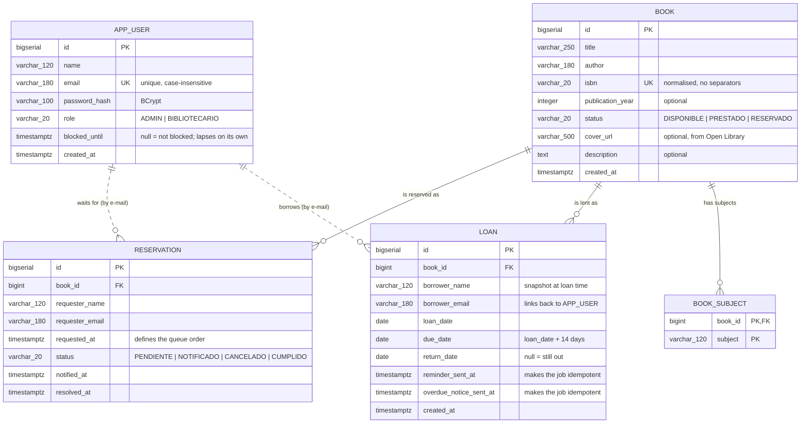

**🌐 Language:** **English** · [Español](data-model.es.md)

# Data model

The schema actually generated by the Flyway migrations
([`V1__create_schema.sql`](../backend/src/main/resources/db/migration/V1__create_schema.sql)),
which is the single source of truth: Hibernate starts with `ddl-auto: validate` and fails
to boot the moment the code and the database disagree.

## Entity-relationship diagram



The dashed lines into `APP_USER` are deliberate: **there is no foreign key** there.

## Why the loan has no FK to the user

The specification defines `Loan` with `borrowerName` and `borrowerEmail`, with no relation
to `AppUser`, yet also asks for `GET /api/loans/mine` and for blocking accounts after
repeated late returns. The specification was honoured as written, and the link was
resolved **by e-mail** instead of by a foreign key:

- `borrower_name` is a **snapshot** taken at loan time. If the person's name changes
  later, the historical record still says who the book was actually handed to.
- The block and `/mine` are both resolved by looking `app_user` up with `lower(email)`.

This is documented in the [README](../README.md) as a deliberate decision.

## Business rules the database itself enforces

Not everything is left to the service layer: some invariants live in the schema, so
neither a race condition nor a manual `INSERT` can violate them.

| Index / constraint | What it guarantees |
|---|---|
| `uk_loan_open_per_book` (partial unique, `WHERE return_date IS NULL`) | **A copy can never be out on two open loans at once** |
| `uk_reservation_active` (partial unique, `WHERE status IN ('PENDIENTE','NOTIFICADO')`) | Nobody holds two places in the same queue |
| `uk_app_user_email` (unique on `lower(email)`) | `Ana@x.cl` and `ana@x.cl` are the same account |
| `ck_book_status`, `ck_reservation_status`, `ck_app_user_role` | The enum columns cannot take made-up values |
| `ck_loan_due_after_loan`, `ck_loan_return_after_loan` | Dates stay internally consistent |
| `ix_loan_open_due_date` (partial) | The daily jobs never scan the whole loan history |

## Inspecting the database

With the stack running (`docker compose up`):

```bash
# Interactive SQL console
docker exec -it libris-postgres psql -U libris -d libris

# A single query
docker exec libris-postgres psql -U libris -d libris -c "select * from book limit 5;"
```

From a graphical client (DBeaver, pgAdmin, DataGrip):

| Field | Value |
|---|---|
| Host | `localhost` |
| Port | `5432` |
| Database | `libris` |
| Username | `libris` |
| Password | `libris` |

## Handy queries

```sql
-- Catalogue breakdown by status
select status, count(*) from book group by status;

-- Open loans with their derived status
select b.title, l.borrower_email, l.due_date,
       case when l.due_date < current_date then 'OVERDUE'
            when l.due_date <= current_date + 3 then 'DUE SOON'
            else 'ACTIVE' end as computed_status
from loan l join book b on b.id = l.book_id
where l.return_date is null
order by l.due_date;

-- The "3 late returns in 90 days" rule, exactly as the backend computes it
select borrower_email, count(*) as late_returns
from loan
where return_date is not null
  and return_date > due_date
  and return_date >= current_date - 90
group by borrower_email
order by late_returns desc;

-- Blocked accounts and until when
select name, email, blocked_until
from app_user
where blocked_until > now();

-- The waiting list for one title, in order
select r.status, r.requester_email, r.requested_at
from reservation r join book b on b.id = r.book_id
where b.isbn = '9780132350884' and r.status in ('PENDIENTE','NOTIFICADO')
order by r.requested_at;

-- Confirm the e-mail jobs are idempotent
select id, borrower_email, reminder_sent_at, overdue_notice_sent_at
from loan where return_date is null;

-- Which migrations actually applied
select version, description, success from flyway_schema_history order by installed_rank;
```

## Sample data

The `demo` profile (on by default in `docker-compose.yml`) loads
[`V900__demo_activity.sql`](../backend/src/main/resources/db/demo/V900__demo_activity.sql),
which lives outside `db/migration` on purpose so a real deployment never receives it.

Everything in it is relative to `current_date`, so the scenario makes sense on whatever
day the stack happens to start: open loans, one overdue, a waiting list, and three
accounts with different levels of late returns — including one that is blocked — so the
dashboards and the rules can be seen working without setting anything up by hand.

To start from a clean database instead:

```bash
SPRING_PROFILES_ACTIVE=default docker compose up --build
```
